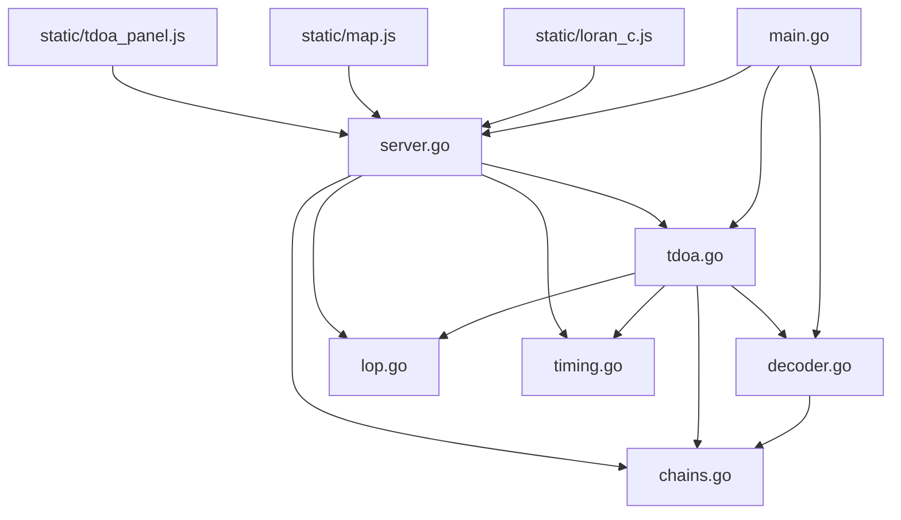
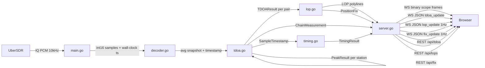

# Loran-C Signal Analysis — Architecture Plan

## Overview

This document describes the complete architecture for extending the existing
pulse-envelope viewer into a full Loran-C signal analysis tool with TDOA
measurement, Line-of-Position (LOP) computation, position fixing, UTC timing,
and signal quality metrics.

All existing functionality is preserved unchanged. New capabilities are layered
on top via new Go source files, new REST/WebSocket endpoints, and an extended
frontend.

---

## 1. Accuracy Analysis at 10 kHz Sample Rate

Before designing the system it is essential to understand the fundamental
accuracy limits.

### 1.1 Raw sample resolution

At 10 kHz, one sample = **0.1 ms = 100 µs**. The Loran-C pulse group spacing
is ~1 ms, so each pulse occupies ~10 samples. The pulse envelope peak is
broad (the 100 kHz carrier envelope rises over ~65 µs and falls over ~200 µs),
so the peak is well-sampled.

### 1.2 Sub-sample interpolation

Parabolic interpolation on three samples around the peak gives sub-sample
accuracy. For a smooth, noise-free peak the theoretical precision is:

```
σ_interp ≈ σ_noise / (SNR × √2)   [samples]
```

At SNR = 20 dB (power ratio 100), σ_noise ≈ 0.01 samples → **~1 µs**.
At SNR = 10 dB (power ratio 10), σ_noise ≈ 0.03 samples → **~3 µs**.

The GRI-folded EMA average suppresses noise by √N where N = number of GRI
periods averaged. With EMA decay=256 the effective N ≈ 128, giving ~11 dB
noise reduction. Practical peak timing precision: **2–10 µs** depending on
signal strength.

### 1.3 TDOA to position accuracy

1 µs TDOA error → ~300 m position error (c × 1 µs ≈ 300 m).
10 µs TDOA error → ~3 km position error.

This is consistent with published Loran-C accuracy figures (0.1–0.5 NM for
standard receivers, which use 100 kHz sampling and carrier-phase tracking).

### 1.4 Higher sample rate

The UberSDR "iq" mode delivers 10 kHz. A higher-rate mode (e.g. 48 kHz or
192 kHz) would give proportionally better raw resolution but the dominant
error at 10 kHz is already interpolation noise, not quantisation. The main
benefit of higher rate would be carrier-phase tracking (measuring the 100 kHz
carrier zero-crossings), which can achieve ~30 ns precision. This is a future
enhancement; the current architecture is designed to accommodate it.

### 1.5 Propagation velocity

The speed of EM waves over the ground is not c = 299,792 km/s. The standard
Loran-C correction uses:

- **Over seawater**: c_sw ≈ 299,700 km/s (ASF ≈ 0 for short paths)
- **Over land**: c_land ≈ 299,400–299,600 km/s depending on conductivity
- **Additional Secondary Factor (ASF)**: path-specific correction, typically
  ±1–5 µs, stored in published tables

For the initial implementation we use c = 299,700 km/s (seawater) as the
default, with a per-chain configurable override. ASF correction is a future
enhancement.

---

## 2. Data Model Changes

### 2.1 `chains.go` — Add transmitter coordinates

Add `Lat`, `Lon` fields to `Station`. These are WGS-84 decimal degrees.

```go
type Station struct {
    ID      string  `json:"id"`
    Name    string  `json:"name"`
    DelayUS float64 `json:"delay_us"`
    Lat     float64 `json:"lat"`      // WGS-84 decimal degrees, 0 = unknown
    Lon     float64 `json:"lon"`      // WGS-84 decimal degrees, 0 = unknown
}
```

Coordinates for all active stations (sourced from published ITU/USCG data):

| Chain | Station | Lat | Lon |
|-------|---------|-----|-----|
| GRI 5960 North Russia | Inta (M) | 66.05 | 60.08 |
| GRI 5960 | Tumanny Pen (X) | 69.08 | 35.68 |
| GRI 5960 | Norilsk (Z) | 69.35 | 88.07 |
| GRI 5990 Caucasus | Caucasian Center (M) | 44.15 | 44.02 |
| GRI 5990 | Caucasian West (X) | 44.97 | 38.87 |
| GRI 5990 | Caucasian East (Y) | 44.02 | 50.03 |
| GRI 5990 | Caucasian North (Z) | 46.02 | 44.97 |
| GRI 6731 Anthorn | Anthorn (M) | 54.912 | -3.277 |
| GRI 6731 | Anthorn (Y) | 54.912 | -3.277 |
| GRI 6780 China South Sea | Hexian (M) | 24.68 | 111.57 |
| GRI 6780 | Raoping (X) | 23.72 | 116.98 |
| GRI 6780 | Chongzuo (Y) | 22.38 | 107.37 |
| GRI 7430 China North Sea | Rongcheng (M) | 37.17 | 122.42 |
| GRI 7430 | Xuancheng (X) | 30.95 | 118.75 |
| GRI 7430 | Helong (Y) | 42.55 | 129.00 |
| GRI 7950 Eastern Russia | Aleksandrovsk (M) | 50.90 | 142.17 |
| GRI 7950 | Petropavlovsk (W) | 53.02 | 158.65 |
| GRI 7950 | Ussuriisk (X) | 43.80 | 132.00 |
| GRI 8000 Western Russia | Bryansk (M) | 53.25 | 34.37 |
| GRI 8000 | Petrozavodsk (W) | 61.78 | 34.35 |
| GRI 8000 | Slonim (X) | 53.08 | 25.32 |
| GRI 8000 | Simferopol (Y) | 44.92 | 34.10 |
| GRI 8000 | Syzran (Z) | 53.15 | 48.47 |
| GRI 8390 China East Sea | Xuancheng (M) | 30.95 | 118.75 |
| GRI 8390 | Raoping (X) | 23.72 | 116.98 |
| GRI 8390 | Rongcheng (Y) | 37.17 | 122.42 |
| GRI 8830 Saudi Arabia | Afif (M) | 23.92 | 42.93 |
| GRI 8830 | Salwa (W) | 24.75 | 50.82 |
| GRI 8830 | Ash Shaykh (Y) | 18.28 | 42.57 |
| GRI 8830 | Al Muwassam (Z) | 17.47 | 44.13 |
| GRI 9930 Korea | Pohang (M) | 36.02 | 129.37 |
| GRI 9930 | Kwang Ju (W) | 35.12 | 126.92 |

> **Note**: Stations marked as "(ex-...)" or single-station chains have
> coordinates set to 0,0 (unknown). TDOA computation is skipped for those.

---

## 3. New Go Source Files

### 3.1 `tdoa.go` — Peak detection and TDOA measurement

This file owns all signal processing between the raw `avg[]` array and a
measured time-of-arrival.

#### 3.1.1 Peak detection

The averaged power envelope `avg[0..nbucket-1]` is a float32 array. We need
to find the peak of each pulse group. Loran-C has 8 pulses per group (master)
or 8 pulses (secondary), spaced 1 ms apart. At 10 kHz, 1 ms = 10 buckets.

**Algorithm**:
1. Find the global maximum bucket `b_max` in `avg[]`.
2. Search for local maxima within ±5 buckets of `b_max` (the master pulse).
3. For each local maximum at bucket `b`, apply **parabolic interpolation**:

```
Given three consecutive samples: y[-1], y[0], y[+1]
Peak offset from centre:  δ = (y[-1] - y[+1]) / (2*(y[-1] - 2*y[0] + y[+1]))
Sub-sample peak position: b_peak = b + δ
```

This is exact for a parabolic peak and a good approximation for a Gaussian
or raised-cosine envelope. The error is O(δ³) for smooth peaks.

4. Convert bucket position to microseconds:
```
t_us = b_peak × ms_per_bin × 1000
```

where `ms_per_bin = 1/srate × 1000` (= 0.1 ms at 10 kHz).

#### 3.1.2 SNR estimation

For each detected peak at bucket `b_peak`:
- **Signal power**: `S = avg[b_peak]` (interpolated)
- **Noise floor**: median of `avg[]` excluding ±20 buckets around each peak
- **SNR_dB**: `10 × log10(S / N)`

#### 3.1.3 TDOA computation

For a chain with master M at bucket `b_M` and secondary X at bucket `b_X`:

```
measured_delay_us = (b_X - b_M) × ms_per_bin × 1000
TDOA_residual_us  = measured_delay_us - emission_delay_us[X]
```

The `TDOA_residual_us` is the quantity used for LOP computation:
```
TDOA_us = TDOA_residual_us
        = (t_arrival_X - t_arrival_M) - (t_emission_X - t_emission_M)
        = (d_X - d_M) / c_prop
```

where `d_M`, `d_X` are the propagation distances from receiver to M and X.

#### 3.1.4 Structs

```go
// PeakResult holds the result of peak detection on one station's pulse.
type PeakResult struct {
    BucketFloat float64 // sub-sample bucket position
    TimeUS      float64 // arrival time in µs within the GRI period
    Power       float32 // interpolated peak power
    SNR_dB      float64 // signal-to-noise ratio in dB
    Valid       bool    // false if no clear peak found
}

// TDOAResult holds the TDOA between master and one secondary.
type TDOAResult struct {
    ChainGRI       uint32  // GRI of the chain
    MasterID       string  // "M"
    SecondaryID    string  // "X", "Y", "Z", "W"
    MeasuredDelayUS float64 // measured arrival delay in µs
    EmissionDelayUS float64 // nominal emission delay from chain database
    TDOA_US        float64 // residual = measured - emission
    MasterSNR      float64 // master peak SNR in dB
    SecondarySNR   float64 // secondary peak SNR in dB
    Timestamp      time.Time // wall-clock time of measurement
    Valid          bool
}

// ChainMeasurement holds all measurements for one chain in one update cycle.
type ChainMeasurement struct {
    ChainIndex int
    ChainGRI   uint32
    Peaks      []PeakResult  // one per station, in station order
    TDOAs      []TDOAResult  // one per secondary (M→X, M→Y, M→Z, M→W)
    UpdatedAt  time.Time
}
```

#### 3.1.5 Integration with `LoranDecoder`

Add a method `GetAvg(ch int) ([]float32, uint32, float64)` to `LoranDecoder`
that returns a copy of `avg[]`, `nbucket`, and `msPerBin` under the mutex.
The TDOA engine calls this after each scope frame emission.

Add a `MeasurementCallback` field to `LoranDecoder`:
```go
type LoranDecoder struct {
    // ... existing fields ...
    OnMeasurement func(m ChainMeasurement) // called after each scope update
}
```

The TDOA engine is instantiated in `main.go` and wired to `OnMeasurement`.

---

### 3.2 `lop.go` — Line-of-Position and position fix

#### 3.2.1 Geodetic helpers

All geometry uses WGS-84. We need:

**Haversine distance** (for distances up to ~5000 km, error < 0.3%):
```go
func haversineKm(lat1, lon1, lat2, lon2 float64) float64
```

**Vincenty inverse** (for accurate distances, used in LOP computation):
```go
func vincentyKm(lat1, lon1, lat2, lon2 float64) (dist, az1, az2 float64)
```

**Forward geodesic** (given start point, azimuth, distance → end point):
```go
func vincentyDirect(lat, lon, azDeg, distKm float64) (lat2, lon2 float64)
```

These are standard algorithms; implement from scratch in ~150 lines.

#### 3.2.2 LOP computation

A Loran-C LOP is a hyperbola defined by:

```
d(R, M) - d(R, X) = c_prop × TDOA_us × 1e-6   [km]
```

where `d(R, M)` is the great-circle distance from receiver R to master M,
`d(R, X)` is the distance to secondary X, and `c_prop` is the propagation
speed in km/s.

**Default**: `c_prop = 299700.0 km/s` (seawater). Configurable per chain.

To trace the hyperbola as a set of lat/lon points:

1. Compute the baseline distance `D = d(M, X)` and midpoint `P_mid`.
2. The hyperbola has foci at M and X, with `2a = |c_prop × TDOA_us × 1e-6|`.
3. Parameterise by angle θ from the baseline:
   - For each θ in [-85°, +85°] (step 1°), solve for the point R such that
     `d(R,M) - d(R,X) = 2a` using Newton-Raphson iteration on the geodesic.
4. Return the array of (lat, lon) points.

**Newton-Raphson for one point**:
Given a starting point R₀ on the perpendicular bisector of MX, iterate:
```
f(R)  = d(R,M) - d(R,X) - 2a
f'(R) = cos(α_M) - cos(α_X)   [directional derivative along search direction]
R_{n+1} = R_n - f(R_n)/f'(R_n)
```
where α_M, α_X are the azimuths from R to M and X respectively.
Converges in 3–5 iterations to < 1 m accuracy.

**Practical implementation**: trace the hyperbola by marching along it.
Start at the point on the perpendicular bisector of MX closest to the
hyperbola (distance from midpoint = `√(b² + (D/2)²)` where `b² = (D/2)² - a²`),
then step along the curve using the tangent direction.

```go
type LOPPoint struct {
    Lat float64 `json:"lat"`
    Lon float64 `json:"lon"`
}

type LOP struct {
    ChainGRI    uint32    `json:"chain_gri"`
    MasterID    string    `json:"master_id"`
    SecondaryID string    `json:"secondary_id"`
    TDOA_US     float64   `json:"tdoa_us"`
    Points      []LOPPoint `json:"points"`  // ~170 points tracing the hyperbola
    Valid       bool      `json:"valid"`
}
```

#### 3.2.3 Position fix

Given two or more LOPs, find the intersection point using iterative
least-squares (Gauss-Newton).

**State vector**: `x = [lat, lon]` (receiver position, in radians internally).

**Observation equation** for LOP i (master Mᵢ, secondary Xᵢ, TDOA τᵢ):
```
hᵢ(x) = d(x, Mᵢ) - d(x, Xᵢ)   [km]
rᵢ     = c_prop × τᵢ × 1e-6     [km]  (observed)
```

**Residual**: `eᵢ = hᵢ(x) - rᵢ`

**Jacobian row** (partial derivatives w.r.t. lat, lon):
```
∂hᵢ/∂lat = cos(az_Mi)×∂d_Mi/∂lat - cos(az_Xi)×∂d_Xi/∂lat
∂hᵢ/∂lon = cos(az_Mi)×∂d_Mi/∂lon - cos(az_Xi)×∂d_Xi/∂lon
```

where the partials of geodesic distance are computed from the Vincenty
forward azimuth.

**Gauss-Newton update**:
```
Δx = -(JᵀJ)⁻¹ Jᵀ e
x_{k+1} = x_k + Δx
```

Iterate until `|Δx| < 1 m` or 20 iterations. Divergence check: if
`|Δx| > 1000 km` after any step, abort.

**Initial estimate**: centroid of all transmitter positions (crude but
sufficient for convergence within the coverage area).

```go
type PositionFix struct {
    Lat        float64   `json:"lat"`
    Lon        float64   `json:"lon"`
    HDOP       float64   `json:"hdop"`       // horizontal dilution of precision
    ResidualUS float64   `json:"residual_us"` // RMS TDOA residual in µs
    NumLOPs    int       `json:"num_lops"`
    LOPsUsed   []string  `json:"lops_used"`  // e.g. ["8000-M-X", "8000-M-W"]
    Timestamp  time.Time `json:"timestamp"`
    Valid      bool      `json:"valid"`
}
```

**HDOP computation**: from the diagonal of `(JᵀJ)⁻¹` scaled by the
RMS residual. This gives a meaningful uncertainty estimate.

---

### 3.3 `timing.go` — Absolute arrival time / UTC reference

#### 3.3.1 Concept

The UberSDR PCM packet header contains a `wall-clock ms` field (64-bit
milliseconds since Unix epoch). This timestamps the start of each PCM packet.

By tracking the sample count within the current packet and the known sample
rate, we can compute the wall-clock time of any specific sample:

```
t_sample = t_packet_start + (sample_index / srate) × 1e9   [nanoseconds]
```

The master pulse arrival time within the GRI period is:
```
t_master_arrival = t_sample_of_GRI_start + b_master × (1/srate)
```

#### 3.3.2 Implementation

Add a `WallClockNs` field to the sample processing pipeline:

In `main.go`, extract the wall-clock timestamp from the PCM full header
(bytes [12:20], little-endian uint64, milliseconds) and pass it to the
decoder alongside the samples.

Add to `LoranDecoder`:
```go
type SampleTimestamp struct {
    WallClockNs int64  // nanoseconds since Unix epoch
    SampleIndex uint64 // absolute sample counter at this timestamp
}
```

Track the absolute sample counter in `LoranDecoder`. When a scope frame
is emitted, record the wall-clock time of the GRI boundary.

```go
type TimingResult struct {
    ChainGRI         uint32    `json:"chain_gri"`
    MasterArrivalUTC time.Time `json:"master_arrival_utc"`
    // Offset from nominal UTC second (for use as timing reference)
    UTCOffsetNs      int64     `json:"utc_offset_ns"`
    // Stability: standard deviation of last N measurements
    StabilityNs      int64     `json:"stability_ns"`
    Valid            bool      `json:"valid"`
}
```

#### 3.3.3 Accuracy

The wall-clock timestamp in the UberSDR packet has ~1 ms resolution (it is
a millisecond counter). The sample clock is stable (crystal oscillator) but
not disciplined to UTC. Therefore:

- **Short-term precision**: ~100 µs (one sample period)
- **Absolute accuracy**: limited by the UberSDR host's system clock, typically
  ±1–10 ms without NTP, ±1 ms with NTP
- **Drift**: the sample clock drifts relative to UTC; measure and report the
  drift rate over time

This is useful as a relative timing reference (comparing arrival times across
GRI periods) but not as a primary UTC source without GPS-disciplined hardware.

---

### 3.4 Signal quality metrics (additions to `decoder.go`)

Add to `loranChannel`:
```go
// Signal quality metrics — updated each scope frame
snrDB       float64  // peak SNR in dB
peakPower   float32  // peak avg[] value
noiseFloor  float32  // estimated noise floor
stability   float64  // std-dev of peak position over last N frames (µs)
peakHistory [32]float64 // ring buffer of recent peak positions (µs)
peakHistIdx int
```

Add method to `LoranDecoder`:
```go
func (d *LoranDecoder) GetQuality(ch int) ChannelQuality
```

```go
type ChannelQuality struct {
    ChIndex    int     `json:"ch_index"`
    GRI        uint32  `json:"gri"`
    SNR_dB     float64 `json:"snr_db"`
    PeakPower  float32 `json:"peak_power"`
    NoiseFloor float32 `json:"noise_floor"`
    StabilityUS float64 `json:"stability_us"` // std-dev of peak position
    Valid      bool    `json:"valid"`
}
```

---

## 4. REST API Extensions

All new endpoints follow the existing pattern in `server.go`.

### 4.1 `GET /api/tdoa`

Returns the latest TDOA measurements for all chains.

```json
{
  "measurements": [
    {
      "chain_gri": 8000,
      "chain_name": "Western Russia (Chayka)",
      "tdoas": [
        {
          "master_id": "M",
          "secondary_id": "X",
          "measured_delay_us": 27131.4,
          "emission_delay_us": 27125.0,
          "tdoa_us": 6.4,
          "master_snr_db": 18.2,
          "secondary_snr_db": 14.7,
          "timestamp": "2026-06-09T11:00:00Z",
          "valid": true
        }
      ]
    }
  ],
  "updated_at": "2026-06-09T11:00:00Z"
}
```

### 4.2 `GET /api/lops`

Returns the current set of LOPs as GeoJSON-compatible lat/lon polylines.

```json
{
  "lops": [
    {
      "chain_gri": 8000,
      "master_id": "M",
      "secondary_id": "X",
      "tdoa_us": 6.4,
      "points": [
        {"lat": 55.1, "lon": 20.3},
        ...
      ],
      "valid": true
    }
  ]
}
```

### 4.3 `GET /api/fix`

Returns the current position fix (if enough LOPs are available).

```json
{
  "lat": 51.509,
  "lon": -0.118,
  "hdop": 2.3,
  "residual_us": 4.1,
  "num_lops": 3,
  "lops_used": ["8000-M-X", "8000-M-W", "5960-M-X"],
  "timestamp": "2026-06-09T11:00:00Z",
  "valid": true
}
```

### 4.4 `GET /api/quality`

Returns signal quality metrics for all channels.

```json
{
  "channels": [
    {
      "ch_index": 8,
      "gri": 8000,
      "snr_db": 18.2,
      "peak_power": 12450.3,
      "noise_floor": 98.1,
      "stability_us": 1.4,
      "valid": true
    }
  ]
}
```

### 4.5 `GET /api/timing`

Returns the absolute timing measurement.

```json
{
  "chain_gri": 8000,
  "master_arrival_utc": "2026-06-09T11:00:00.000123Z",
  "utc_offset_ns": 123000,
  "stability_ns": 45000,
  "valid": true
}
```

### 4.6 `POST /api/config/propagation`

Allows setting the propagation speed override per chain.

```json
{
  "chain_gri": 8000,
  "c_prop_km_s": 299600.0
}
```

---

## 5. WebSocket Push Messages

The existing WebSocket carries binary scope frames. We extend it with new
JSON text messages pushed from server to browser.

### 5.1 `tdoa_update`

Pushed after each TDOA measurement cycle (same rate as scope updates, ~10 Hz).

```json
{
  "type": "tdoa_update",
  "chain_gri": 8000,
  "tdoas": [
    {
      "secondary_id": "X",
      "tdoa_us": 6.4,
      "master_snr_db": 18.2,
      "secondary_snr_db": 14.7,
      "valid": true
    }
  ]
}
```

### 5.2 `lop_update`

Pushed when LOPs are recomputed (throttled to ~1 Hz to avoid flooding).

```json
{
  "type": "lop_update",
  "lops": [
    {
      "chain_gri": 8000,
      "secondary_id": "X",
      "tdoa_us": 6.4,
      "points": [[55.1, 20.3], [55.2, 20.1], ...]
    }
  ]
}
```

Points are `[lat, lon]` pairs (compact array format for bandwidth).

### 5.3 `fix_update`

Pushed when a new position fix is computed (~1 Hz).

```json
{
  "type": "fix_update",
  "lat": 51.509,
  "lon": -0.118,
  "hdop": 2.3,
  "residual_us": 4.1,
  "valid": true
}
```

### 5.4 `quality_update`

Pushed with each scope frame (piggybacks on the existing ~10 Hz rate).

```json
{
  "type": "quality_update",
  "ch": 8,
  "snr_db": 18.2,
  "stability_us": 1.4
}
```

---

## 6. Frontend Architecture

### 6.1 Layout

The existing single-canvas scope display is preserved. A new **split layout**
is introduced:

```
┌─────────────────────────────────────────────────────────────┐
│  Header (existing)                                          │
├──────────────────────────┬──────────────────────────────────┤
│  Scope canvas (existing) │  Map panel (new, Leaflet.js)     │
│  14 rows × 100px         │  LOPs as polylines               │
│                          │  Position fix as marker          │
│                          │  Transmitter markers             │
├──────────────────────────┴──────────────────────────────────┤
│  TDOA / Quality data table (new)                            │
│  Chain | M SNR | Sec | TDOA µs | Residual | Stability       │
└─────────────────────────────────────────────────────────────┘
```

On narrow screens (< 900px), the map panel stacks below the scope.

### 6.2 New files

- `static/map.js` — Leaflet map initialisation, LOP rendering, fix marker
- `static/tdoa_panel.js` — TDOA/quality data table, updated from WS messages
- `static/loran_c.js` — extended to handle new WS message types

### 6.3 Map panel (`static/map.js`)

Uses **Leaflet.js** (loaded from CDN, no build step required) with an
OpenStreetMap tile layer.

```javascript
// LOP rendering
// Each LOP is a Leaflet Polyline with colour matching the chain's TRACE_COLOR.
// LOPs are updated in-place (setLatLngs) to avoid flicker.

// Transmitter markers
// Each known transmitter (lat/lon != 0) is a small CircleMarker.
// Master = red, secondaries = yellow/green/blue/grey.

// Position fix marker
// A pulsing CircleMarker at the computed lat/lon.
// Tooltip shows: lat, lon, HDOP, residual µs, timestamp.

// Auto-zoom
// On first valid fix, map.fitBounds() to show all LOPs.
// Subsequent fixes: smooth pan to fix position.
```

### 6.4 TDOA panel (`static/tdoa_panel.js`)

A `<table>` below the scope canvas, one row per active TDOA pair:

| Chain | Master SNR | Secondary | TDOA µs | Residual µs | Stability µs |
|-------|-----------|-----------|---------|-------------|--------------|
| GRI 8000 Western Russia | 18.2 dB | X Slonim | 6.4 | +6.4 | 1.4 |

Cells are colour-coded:
- SNR: green > 15 dB, yellow 8–15 dB, red < 8 dB
- Stability: green < 5 µs, yellow 5–20 µs, red > 20 µs

### 6.5 Scope canvas extensions

The existing scope canvas gains two overlays drawn after the trace:

1. **Peak marker**: a vertical tick at the detected peak bucket position for
   each station (colour-coded by station ID). Drawn only when SNR > 8 dB.
2. **TDOA annotation**: a small label showing the TDOA residual in µs,
   positioned at the secondary peak.

These are drawn in `loran_c.js` using data from `tdoa_update` WS messages.

---

## 7. Module Dependency Graph



---

## 8. Data Flow



---

## 9. Implementation Plan — File by File

### Step 1: `chains.go`
- Add `Lat float64` and `Lon float64` to `Station` struct
- Populate coordinates for all stations with known positions
- No other changes; existing JSON tags preserved

### Step 2: `decoder.go`
- Add `GetAvg(ch int) (avg []float32, nbucket uint32, msPerBin float64)` method
  (returns a copy under the mutex — safe for the TDOA goroutine to read)
- Add `OnMeasurement func(ChainMeasurement)` callback field
- Add `ChannelQuality` struct and `GetQuality(ch int) ChannelQuality` method
- Add per-channel quality fields to `loranChannel`:
  `snrDB`, `noiseFloor`, `peakHistory [32]float64`, `peakHistIdx int`
- Update `ProcessSamples` to call `OnMeasurement` after emitting a scope frame
  (outside the mutex, same pattern as the existing `fn` callback)

### Step 3: `tdoa.go` (new file)
- `parabolicPeak(avg []float32, b int) (float64, float32)` — sub-sample peak
- `estimateNoise(avg []float32, peaks []int) float32` — median noise floor
- `DetectPeaks(avg []float32, nbucket uint32, msPerBin float64, chain Chain) []PeakResult`
- `ComputeTDOAs(peaks []PeakResult, chain Chain, ts time.Time) []TDOAResult`
- `TDOAEngine` struct: holds latest `ChainMeasurement` per chain, mutex-protected
- `TDOAEngine.Process(m ChainMeasurement)` — called from `OnMeasurement`
- `TDOAEngine.Latest() []ChainMeasurement` — for REST API

### Step 4: `lop.go` (new file)
- `haversineKm`, `vincentyKm`, `vincentyDirect` — geodetic primitives
- `ComputeLOP(tdoa TDOAResult, master, secondary Station, cProp float64) LOP`
  — traces the hyperbola as ~170 lat/lon points
- `ComputeFix(lops []LOP, tdoas []TDOAResult) PositionFix`
  — Gauss-Newton least-squares intersection
- `LOPEngine` struct: holds latest `[]LOP` and `PositionFix`, mutex-protected
- `LOPEngine.Update(measurements []ChainMeasurement)` — recomputes LOPs + fix
- `LOPEngine.LatestLOPs() []LOP`
- `LOPEngine.LatestFix() PositionFix`

### Step 5: `timing.go` (new file)
- `TimingEngine` struct
- `TimingEngine.RecordPacket(wallClockMs uint64, sampleIndex uint64)`
  — called from `main.go` for each PCM packet
- `TimingEngine.MasterArrival(ch int, bucketFloat float64) TimingResult`
  — computes UTC arrival time from sample index + wall-clock anchor
- Drift tracking: linear regression over last 60 measurements

### Step 6: `server.go`
- Add `TDOAEngine`, `LOPEngine`, `TimingEngine` fields to `ScopeServer`
- Register new REST handlers: `/api/tdoa`, `/api/lops`, `/api/fix`,
  `/api/quality`, `/api/timing`, `/api/config/propagation`
- Add `BroadcastTDOA`, `BroadcastLOP`, `BroadcastFix` methods
- Wire `LOPEngine.Update` on a 1 Hz ticker goroutine
- Wire `BroadcastTDOA` from `TDOAEngine.Process` callback

### Step 7: `main.go`
- Extract wall-clock timestamp from PCM full header and pass to `TimingEngine`
- Wire `LoranDecoder.OnMeasurement` to `TDOAEngine.Process`
- Instantiate `TDOAEngine`, `LOPEngine`, `TimingEngine` and pass to `ScopeServer`

### Step 8: `static/index.html`
- Add Leaflet.js CDN link
- Add map panel `<div id="map-panel">` alongside scope card
- Add TDOA table `<div id="tdoa-panel">` below scope card
- Add CSS for split layout (flexbox, responsive)

### Step 9: `static/map.js` (new file)
- Initialise Leaflet map in `#map-panel`
- Handle `lop_update` WS messages — update polylines
- Handle `fix_update` WS messages — update fix marker
- Load transmitter positions from `/api/chains` — place CircleMarkers
- Auto-zoom on first valid fix

### Step 10: `static/tdoa_panel.js` (new file)
- Build `<table>` in `#tdoa-panel`
- Handle `tdoa_update` WS messages — update table rows
- Handle `quality_update` WS messages — update SNR/stability cells
- Colour-code cells by threshold

### Step 11: `static/loran_c.js`
- Handle `tdoa_update` messages — draw peak markers and TDOA labels on scope
- Handle `quality_update` messages — update per-row SNR indicator in left legend

---

## 10. Accuracy Limitations Summary

| Source | Magnitude | Notes |
|--------|-----------|-------|
| Sample quantisation | 100 µs | One sample at 10 kHz |
| Parabolic interpolation | 1–10 µs | Depends on SNR |
| EMA averaging noise | ~3 µs at SNR=15dB | Improves with more averages |
| Propagation speed uncertainty | 5–50 µs | Land paths vs seawater |
| ASF (Additional Secondary Factor) | 1–10 µs | Path-specific, not corrected |
| System clock accuracy | 1–10 ms | UberSDR host NTP quality |
| **Total TDOA error** | **~5–20 µs** | Typical over-land scenario |
| **Position error** | **~1.5–6 km** | At 300 m/µs |

For comparison, a dedicated Loran-C receiver with carrier-phase tracking
achieves 0.1–0.5 µs TDOA → 30–150 m position accuracy.

### Improving accuracy within the current architecture

1. **Increase EMA decay**: higher `avg_param` → more averaging → lower noise
   floor → better interpolation. Trade-off: slower response to signal changes.
2. **Use all 8 pulses**: the current implementation folds the entire GRI period.
   Explicitly identifying and averaging each of the 8 pulses separately, then
   combining, gives ~3 dB SNR improvement.
3. **Carrier-phase tracking** (future): requires higher sample rate mode
   (>= 200 kHz) to resolve the 100 kHz carrier. Would improve TDOA to ~0.1 µs.

---

## 11. Key Design Decisions

### Why parabolic interpolation, not Gaussian fit?

Parabolic interpolation requires only 3 points and is O(1). For the Loran-C
pulse envelope (which is approximately Gaussian near the peak), the two methods
give nearly identical results. Gaussian fit requires `log()` calls and is more
sensitive to noise in the tails.

### Why Gauss-Newton, not direct hyperbola intersection?

Direct algebraic intersection of two hyperbolae in geodetic coordinates has no
closed form. Gauss-Newton is robust, handles overdetermined systems (3+ LOPs)
naturally, and provides the covariance matrix for HDOP computation.

### Why Leaflet.js, not a custom canvas map?

Leaflet provides tile-based background maps, proper geodetic projection
(Web Mercator), and well-tested polyline rendering. The alternative (custom
canvas with equirectangular projection) would require implementing map tiles,
zoom, and pan from scratch. Leaflet adds ~40 kB (minified+gzip) with no build
step.

### Why separate `tdoa.go` / `lop.go` / `timing.go` rather than extending `decoder.go`?

`decoder.go` is a faithful port of the KiwiSDR C++ source and should remain
minimal and auditable. The new signal processing is architecturally distinct
(it operates on the *output* of the GRI accumulator, not on raw samples) and
benefits from being in separate files for clarity and testability.

### Thread safety model

```
IQ goroutine (main.go)
  └─ ProcessSamples() [holds d.mu briefly per sample batch]
       └─ OnMeasurement callback [called outside d.mu]
            └─ TDOAEngine.Process() [holds tdoa.mu]
                 └─ LOPEngine.Update() [holds lop.mu, called on 1Hz ticker]

HTTP goroutines (one per request)
  └─ TDOAEngine.Latest() [holds tdoa.mu RLock]
  └─ LOPEngine.LatestLOPs() [holds lop.mu RLock]
  └─ LOPEngine.LatestFix() [holds lop.mu RLock]

WebSocket write pump goroutines (one per client)
  └─ receive from c.send channel [no shared state]
```

All shared state is protected by `sync.RWMutex`. The IQ goroutine never blocks
on HTTP or WebSocket operations.

---

## 12. Go Module Dependencies

No new external dependencies are required. All new code uses only the standard
library:
- `math` — trigonometry for geodetic calculations
- `sync` — mutexes
- `time` — timestamps
- `sort` — for noise floor median
- `encoding/json` — already imported

The Leaflet.js CDN link adds a frontend dependency but no Go module change.

---

## 13. Testing Strategy

### Unit tests (new file `tdoa_test.go`)
- `TestParabolicPeak`: verify sub-sample accuracy on synthetic Gaussian peaks
- `TestTDOAComputation`: verify TDOA = 0 when master and secondary are
  equidistant from a known receiver position
- `TestHaversine`: verify against known distances (e.g. London to Paris = 340 km)
- `TestVincenty`: verify against NGS online calculator
- `TestLOPPoint`: verify a point on the computed LOP satisfies
  `|d(R,M) - d(R,X) - c*TDOA| < 1 m`
- `TestGaussNewton`: verify fix converges to correct position given synthetic
  TDOA observations from a known receiver location

### Integration test
- Feed a pre-recorded IQ file through the full pipeline
- Verify TDOA measurements are stable (sigma < 5 µs) after 30 s of averaging
- Verify position fix converges to within 50 km of the true receiver location
  (using Western Russia Chayka chain, which covers most of Europe)